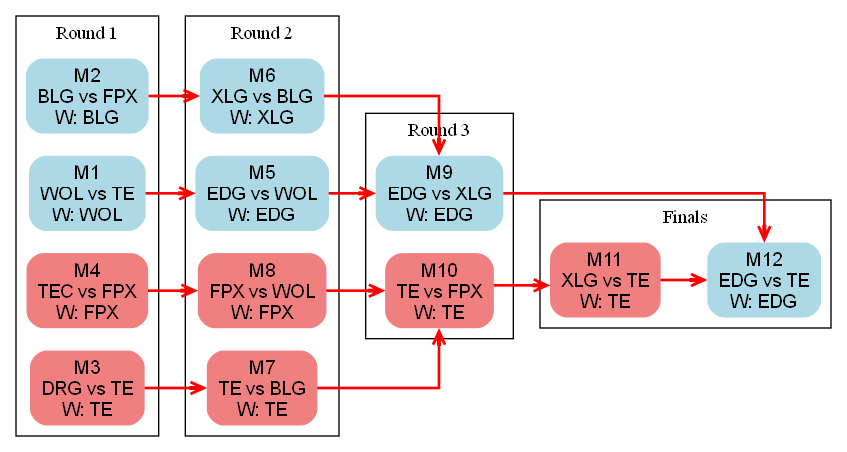

# DataDrivenVCT

## 文件说明
### 代码
**sim.py**：Python 核心脚本，模拟 VCT CN 2025 Stage 2 比赛结果，可从本地或网络获取真实数据，无真实数据则随机模拟。涵盖常规赛和季后赛模拟，能计算队伍积分、排名及晋级概率。使用 Graphviz 可视化季后赛赛果

 生成的季后赛赛果。

### 依赖
- **`requirements.txt`**：列出项目所需 Python 依赖库，如 `graphviz`、`requests` 和 `PyYAML`，保障项目正常运行。

### 数据与配置
- **`yaml/groups.yaml`**：依据 [VCT 2025 China Stage 2](https://www.vlr.gg/event/2499/vct-2025-china-stage-2)，将参赛队伍分为 Alpha 和 Omega 两组。
- **`yaml/initial_pts.yaml`**：参考 [VCT 2025 Championship Points China](https://liquipedia.net/valorant/VCT/2025/Championship_Points/China)，存储各队伍初始积分。
- **`yaml/results.yaml`**：记录真实比赛结果，目前仅含常规赛部分，模拟时优先使用真实数据。

## 待办事项
- [ ] 扩展赛事范围至所有 VCT 国际联赛
- [ ] 实现数据自动更新，确保模拟结果实时准确
- [ ] 丰富可视化功能，生成更多类型图表报表
- [ ] 开发交互式可视化界面，便于数据探索分析
- [ ] 增加数据维度，提供更全面赛事分析