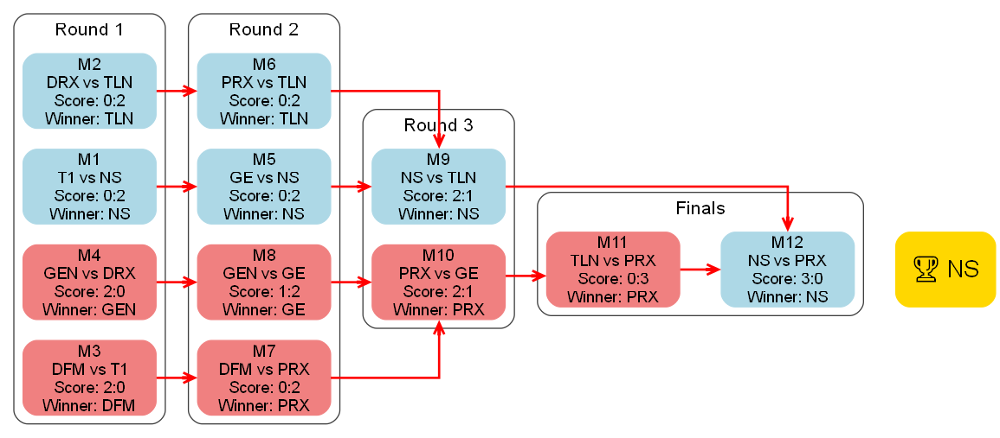

# DataDrivenVCT

## 项目概述

图一乐版VCT赛事数据整活脚本 / JUST FOR FUN SCRIPTS FOR VCT DATA SIMULATION AND VIZ

## 文件说明

### 代码

- **`sim.py`**：Python 核心脚本，用于模拟 VCT 2025 Stage 2 比赛结果。支持从本地或网络获取真实数据，若无真实数据则进行随机模拟。涵盖常规赛和季后赛模拟，能计算队伍积分、排名及晋级概率，使用 Graphviz 可视化季后赛赛果。

### 依赖

- 代码在 Python 3.12 测试可用

- **`requirements.txt`**：列出项目所需 Python 依赖库，如 `graphviz`、`requests` 和 `PyYAML`，保障项目正常运行。安装命令：

  ```bash
  pip install -r requirements.txt
  ```

### 数据与配置

- **`yaml/<region>/groups.yaml`**：参考 [VCT 2025 China Stage 2](https://www.vlr.gg/event/2499/vct-2025-china-stage-2)，将参赛队伍分为 Alpha 和 Omega 两组。
- **`yaml/<region>/initial_pts.yaml`**：参考 [VCT 2025 Championship Points China](https://liquipedia.net/valorant/VCT/2025/Championship_Points/China)，存储各队伍截止多伦多大师赛累计积分。
- **`yaml/<region>/results.yaml`**：记录真实比赛结果，目前仅含常规赛部分，模拟时优先使用真实数据。

## sim.py 使用说明

### 基本用法

```bash
# 单次模拟
python sim.py

# 中国赛区多次模拟
python sim.py --multi --num_simulations 100000

# 太平洋赛区多次模拟
python sim.py --multi --num_simulations 10000 --region pacific
```

### 参数说明

- `--multi`：开启多次模拟模式
- `--num_simulations`：指定模拟次数，默认为 500 次
- `--region`：指定赛区，可选值为 `cn` 或 `pacific`，默认为 `cn`
- `--use_real_data`：优先使用真实比赛数据（如已配置）
- `--map_based`：基于地图胜负进行比赛模拟

## 生成的季后赛赛果样例（图一乐，just for fun）

| **VCT China**                                  | **VCT Pacific**                                          |
| ---------------------------------------------- | -------------------------------------------------------- |
|  |  |

## 待办事项

- [x] 扩展赛事范围至所有 VCT 国际联赛（0720已新增pacific，待更新）
- [ ] 实现数据自动更新，确保模拟结果实时准确
- [ ] 丰富可视化功能，生成更多类型图表报表
- [ ] 开发交互式可视化界面，便于数据探索分析
- [ ] 增加数据维度，提供更全面赛事分析
